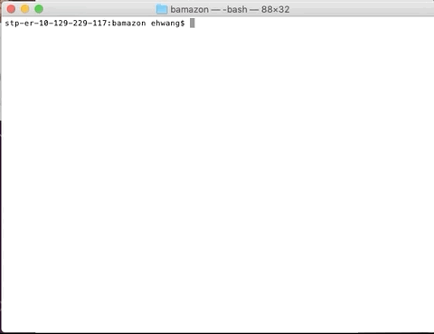

# bamazon

 Bamazon is a CLI-app that allows you to visit Vogner's Shoppe: Home to all your Magical needs! 

 This was an assignment through the University of Minnesota Coding Bootcamp. 

## Getting Started
1. Clone down the repository.

2. Open your command line or Terminal and make sure to run the command `npm install`.

3. Since bamazon uses a MySql database, make sure to install and create the database using the provided `bamazon_DB.sql` file. 

4. Once you have the MySql database set up, you are ready to order from Vogner's Shoppe!

### BamazonCustomer

To begin run `node bamazonCustomer.js` in your terminal or command line. (Make sure to install npm before doing so).

Once you have it running, you can choose either of three options. Choosing to `Browse the Shoppe` will display all the items you can order. 

;

To place an order just choose the `Place an Order` option and it will walk through ordering.

#### Created Using:
* Node.js
* MySql NPM Package
* Inquirer NPM Package
* Cli-Table NPM Package